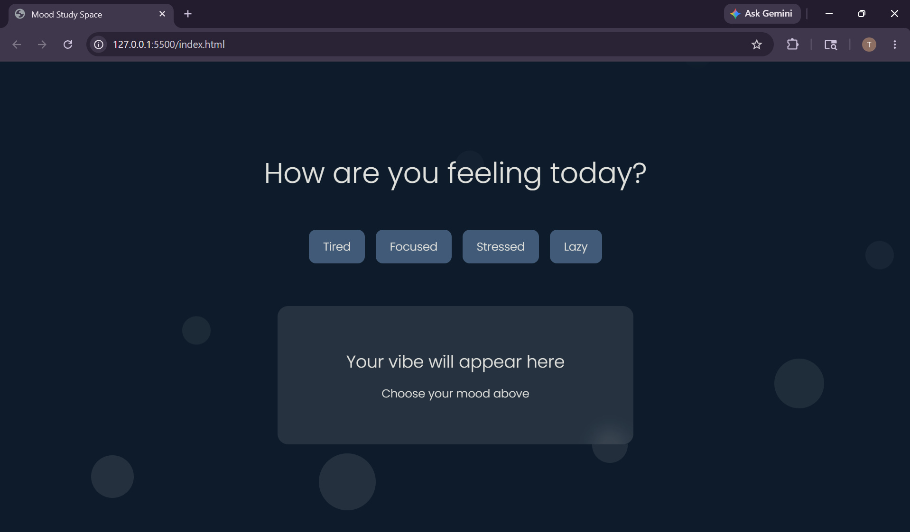

# Mood-Study-Space
Interactive mood-based study website built using HTML, CSS, and JavaScript.

The website changes themes, messages, and overall vibe based on the user's mood while also providing an aesthetic and relaxing UI experience.

## ✨ Features

- Mood-based theme switching
- Interactive UI
- Floating animated bubbles
- Responsive design for phone and desktop
- Glassmorphism effects
- Dynamic study motivation messages

## 🛠 Tech Stack

- HTML
- CSS
- JavaScript

## 📱 Responsive Design

Works smoothly on:
- Desktop
- Tablets
- Mobile devices

## 🚀 Future Improvements

- Pomodoro timer
- Mood history
- Music integration
- Daily quotes API
- Backend mood journal

## 📸 Preview

